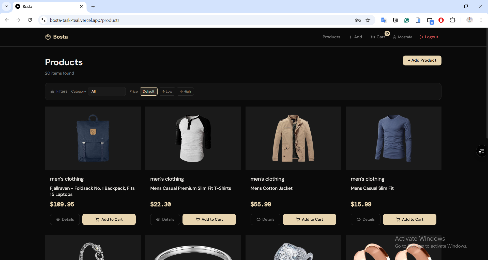
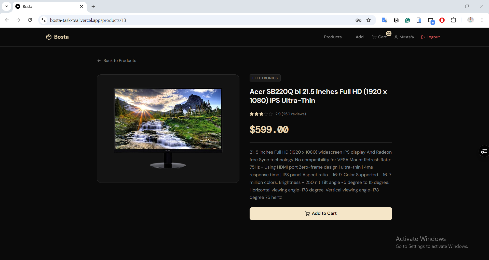
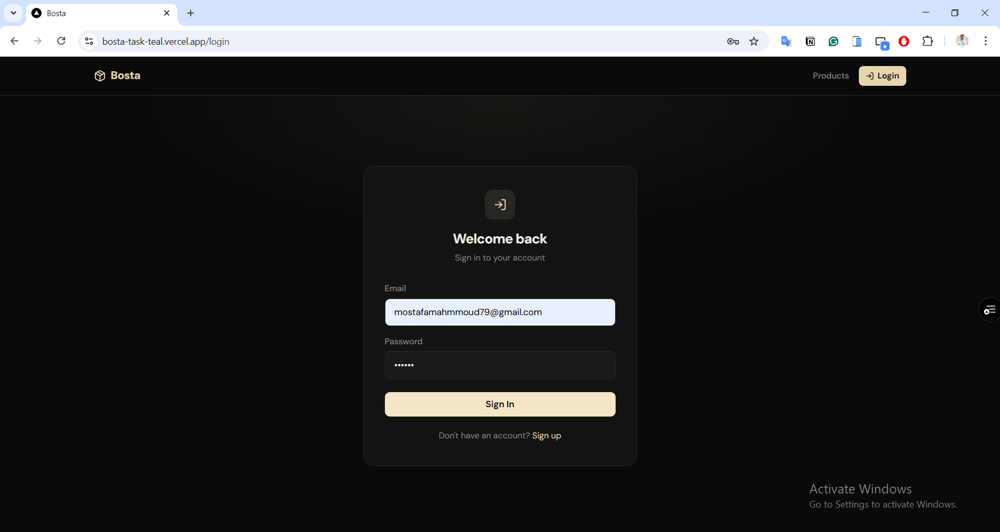
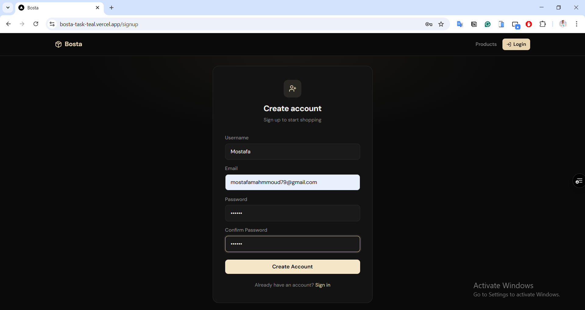

# Bosta — Frontend Technical Assessment

Live demo: [Bosta on Vercel](https://bosta-task-teal.vercel.app/)

---

## Screenshots

  

###  

---

  

###  

---

  

###  

---

  

###  

---

  

###  

---

  

###  

---

  

---

## Project Overview

This project is a **production-ready e-commerce frontend** built with **Next.js 15** and modern React tooling.  
It fully integrates with the **Fake Store API** and demonstrates **my skills** in component architecture, API integration, global state management, and responsive UI design.

**Everything required is implemented by me, including all bonus features.**

The application includes:

- **Product Listing:** API integration, sorting, category filtering, pagination (10 products per page)  
- **Product Details:** Full product info with "Add to Cart"  
- **Create Product:** Fully validated form, submitted via POST request, instant UI update  
- **Authentication:** Email-based signup/login, per-user session, name in header  
- **Cart:** Per-user cart with quantity updates, removal, total price calculation  
- **Protected Routes:** Cart and Create Product require authentication  
- **Instant UX:** I ensured no page refresh is required for cart updates or new products  
- **Responsive Design:** Works on mobile, tablet, laptop, and desktop  

---

## Features

### Core Features
- Product listing with API integration  
- Sorting by price (ascending / descending)  
- Category filtering  
- Pagination (**10 products per page**)  
- Product details page with Back button  
- Create product page with validation and POST request  
- Loading states on all fetches  
- Graceful error handling  
- Empty state handling  
- Instant updates (no page refresh)  

---

### Bonus Features Implemented
**Cart System**
- Add to cart from listing and details  
- Update quantity  
- Remove items from **cart only** (not from main products)  
- Total price calculation  
- Persisted per user in LocalStorage  

**Authentication**
- Email-based register & login  
- Persisted session using zustand/persist  
- Display logged-in user name in header  
- Logout functionality  

**Per-user Data Isolation**
- Each user has independent cart and locally created products  

**Instant UX**
- Cart badge updates instantly  
- Newly created products appear immediately in listing  

**Protected Routes**
- I implemented redirects for unauthenticated users to `/login` for Cart and Create Product  

---

## Tech Stack

- **Next.js 15 (App Router)**  
- **React + TypeScript**  
- **Zustand** for state management  
- **React Hook Form + Zod** for form validation  
- **Axios** for HTTP requests  
- **TailwindCSS v4** for styling  
- **Lucide React** for icons  
- **next/font (DM Sans + DM Mono)** for typography  

---

## API

Base URL: https://fakestoreapi.com

Endpoints used:

- `GET /products`  
- `GET /products/:id`  
- `GET /products/categories`  
- `POST /products`  

> Note: Fake Store API does not persist POST data.  
> Newly created products are mirrored locally using **Zustand + LocalStorage**.  

---

## Getting Started

1. Install dependencies:

```bash
npm install

npm run dev
